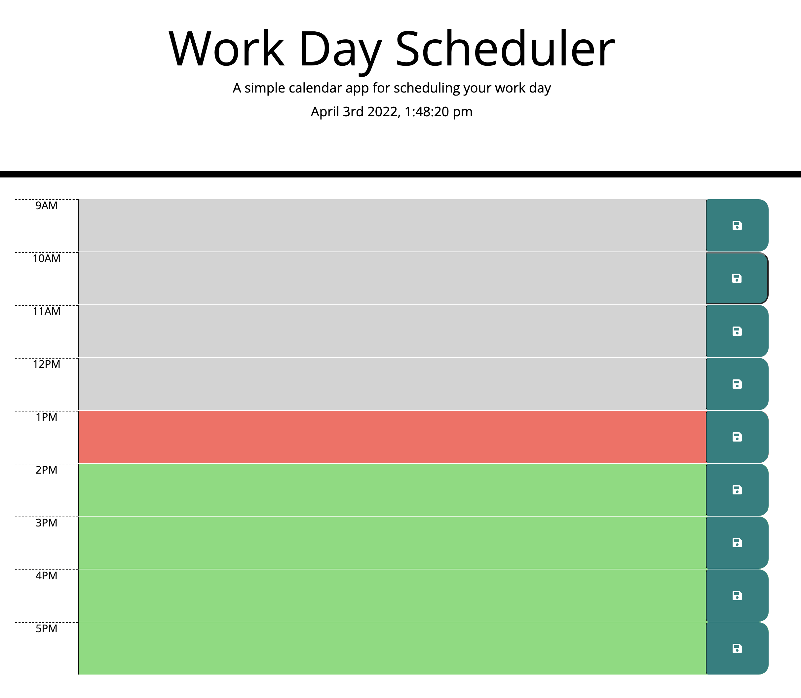

# Work Day Scheduler 

## Description

The user is presented with a day scheduler front page. The user will see the current date at the top of the screen in the header. The user will see three color codes: grey means the hour is in the past, red is the current hour, and green are future hours. The user is able to enter in information in the text area. If the user clicks the save button that information will be saved. If the user refreshes their screen the information will display pulled from their local storage.

## Screenshot of the Calendar

## Link to Open Calendar 

https://youngff43.github.io/super-disco/
